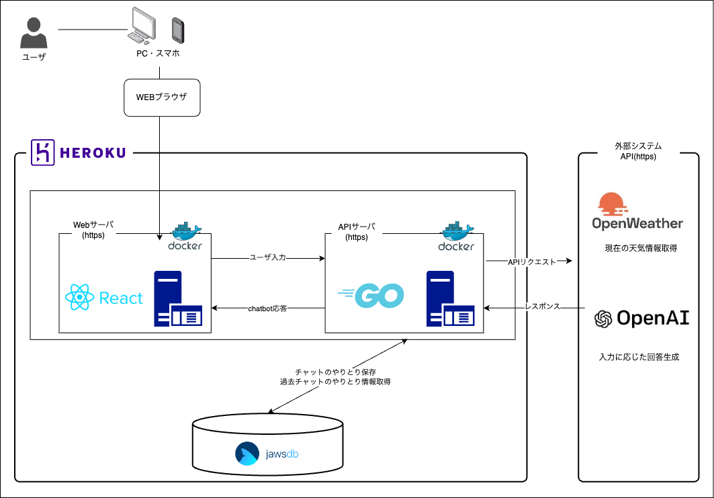

# chatbot-server (Go, gin, Docker, MySQL,Heroku)

このプロジェクトのサーバーサイドは、Go (gin)、Docker、および MySQL (Jaws DB)を使用して開発

## 使用技術

- Go (gin): 軽量で高速な Web フレームワーク
- Air : ホットリロードツール
- Docker: アプリケーションのコンテナ化技術
- MySQL (Jaws DB): データストレージのためのリレーショナルデータベース

## 外部 API

- OpenWeatherMap: W 現在の天候や予測履歴を含む各種気象データの無料 API を提供するオンラインサービス
- OpenAI ChatGPT: 対話型の質問応答、文章生成、文章の要約など、さまざまな自然言語処理タスクに応用できる柔軟な AI アシスタント

## 実装方法

### Go (gin)

1. Go 言語と gin フレームワークを使用して API サーバーを実装
2. API エンドポイントを作成し、データの CRUD 操作を実現
3. Jaws DB を使用した MySQL データベースとの連携を実現

### Docker

1. Dockerfile を作成して、アプリケーションのコンテナ化を実現
2. Docker Compose を使用して、アプリケーションとデータベースのコンテナを連携

## セットアップ

1. `chatbot-client`と併用してプロジェクト作成する場合は、`BuildScripts`フォルダの Makefile, docker-compose.yml を使用してください。

2. Docker がインストールされていることを確認し、clone したディレクトリの親ディレクトリに Makefile を配置して
   `make up` コマンドを実行、アプリケーションとデータベースのコンテナを起動

これでサーバーサイドがローカル環境, docker で実行できるようになります。

## デプロイ

1.  Heroku CLI をインストールして、ルートディレクトリに`heroku.yml` を作成して、以下の手順で heroku にデプロイ
2.  `heroku login` コマンドを実行し、Heroku アカウントにログインしてください。
3.  `heroku create` コマンドを実行して、新しい Heroku アプリを作成してください。
4.  `git push heroku main` コマンドを実行して、アプリケーションを Heroku にデプロイしてください。
5.  必要に応じて、Heroku の環境変数を設定してください。

---

## システム構成図

